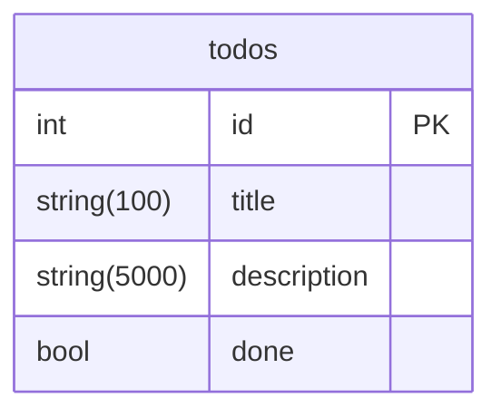

## What you will see in this project
- API (gin)
- Validations
- Gorm And Postgres (gorm)
- Swagger Documentation
- Logger Middleware

## How to run
### 0. Define your configs
~~~
Define your IP and ports in the files config.toml and docker-compose.yml
~~~

### 1. Up database
~~~~
*Necessary docker
Inside the folder third_party/postgres/ run:

sudo chmod +x db-up.sh && ./db-up.sh
~~~~
### 2. Run the go code 
~~~~
Inside the root folder, run:

sudo chmod +x scripts/up.sh && ./scripts/up.sh
~~~~

