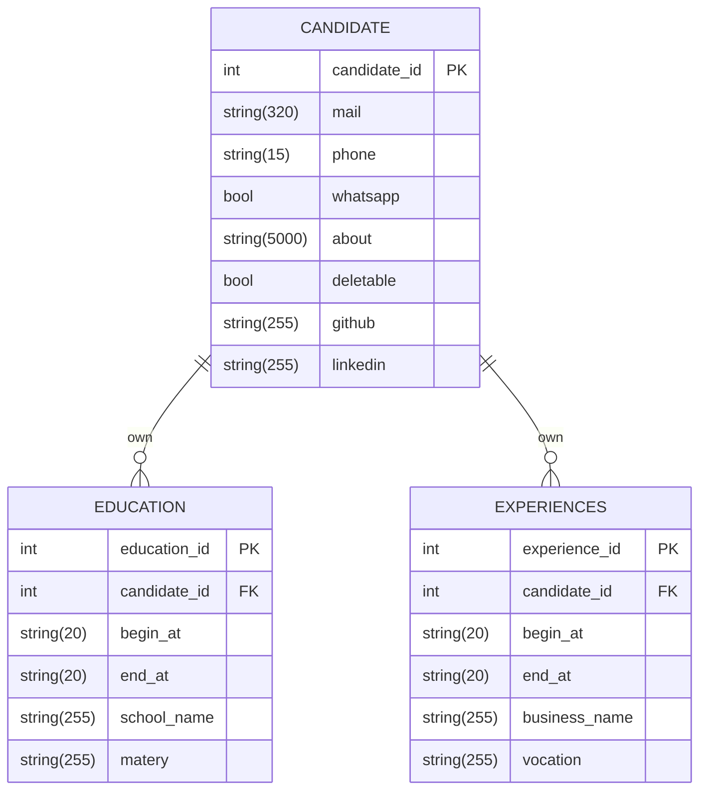

```mermaid
erDiagram
    CANDIDATE ||--o{ EDUCATION : own
    CANDIDATE ||--o{ EXPERIENCES : own
    CANDIDATE {
        int candidate_id PK
        string(320) mail
        string(15) phone
        bool whatsapp
        string(5000) about
        bool deletable
        string(255) github
        string(255) linkedin
    }
    
    EDUCATION {
        int education_id PK
        int candidate_id FK
        string(20) begin_at 
        string(20) end_at
        string(255) school_name
        string(255) matery
    }

    EXPERIENCES {
        int experience_id PK
        int candidate_id FK
        string(20) begin_at
        string(20) end_at
        string(255) business_name
        string(255) vocation
    }
```